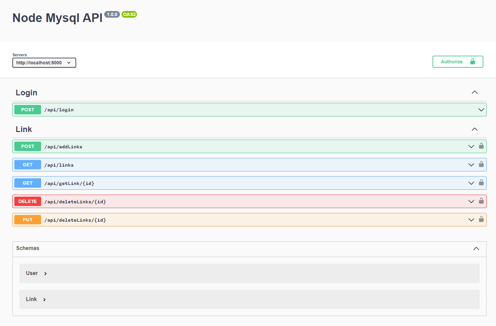

## Proyecto Api enlaces

Api para el programa de enlaces favoritos (documentado).

Programa basado en el lenguaje de Programación `JavaScript`
> Bcryptjs\
> Express\
> Jsonwebtoken\
> Mysql\
> Swagger-jsdoc\
> Swagger-ui-express\

## Estado Proyecto
(completo)

## Imagenes del Proyecto

*Documentación*\

## Instalacion

Clonar el repositorio. Necesita `node` y `npm` instalado globalmente en tu equipo.

Instalar:

`npm i`    

Iniciar el programa:

`npm run dev`

> contiene query DB
